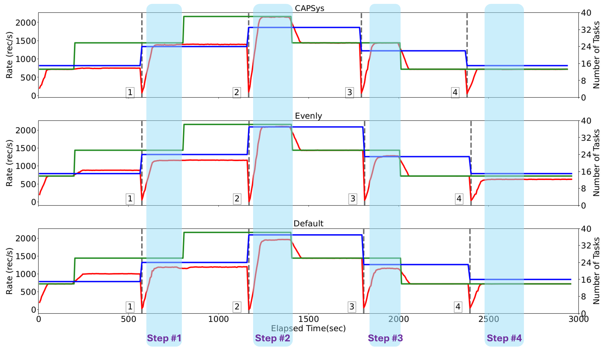

This document describes how to reproduce CAPSys results presented in EuroSys 25 conference. 


# Table of Contents

- [Major Claims](#major-claims)
- [Experiment (E1)](#experiment-e1)
- [Experiment (E2)](#experiment-e2)
- [Experiment (E3)](#experiment-e3)
- [Experiment (E4)](#experiment-e4)


# Major Claims

- (C1): CAPSys outperforms Flink's `default` and `evenly` strategies. This is proven by the experiments ([E1](#experiment-e1)) described in Section 6.1 where we compare CAPSys with Flink's `default` and `evenly` policies on all six queries described in Section A.2.4.
    We provide instructions on how to reproduce Figure 7, as described in Section 6.1.1, which is sufficient to support the claim. Figure 8, described in Section 6.1.2, evaluates the same workload on a larger problem size.

- (C2): We compare CAPSys with the state-of-the-art [ODRP algorithm](https://dl.acm.org/doi/10.1145/3092819.3092823) proposed by Cardellini et al., which can jointly decide the task parallelism and placement of a query. Comparing with CAPSys, the plans generated with different ODRP policies either cannot reach the target throughput and exhibit high backpressure, or shows high resource demand. This is proven by the experiment ([E2](#experiment-e2)), described in Section 6.2, whose results are reported in Table 3.

- (C3): Under variable workloads, CAPSys can improve the accuracy and convergence of the DS2 auto-scaling controller. This is proven by the experiment ([E3](#experiment-e3)) described in Section 6.3. Reproducing results in Table 4 is sufficient to support the claim.

- (C4): CAPS and auto-tuning can quickly and effectively find satisfying placement plans to support dynamic settings where frequent reconfigurations may occur. This is proven by the experiments ([E4](#experiment-e4)) described in Section 6.4, where we measure the runtime of CAPS and auto-tuning on varying problem sizes. For this part, we reproduce results reported in Figure 10.

# Experiments and expected results

Experiments E1, E2, E3 run on AWS EC2 clusters. For simplicity, we have set up ready-to-use AWS clusters for artifact evaluations. Please use our provided SSH key to access them. _If you want to setup your own AWS cluster for evaluation (not recommended), please see instructions [here](./aws/README.md) (ignore this if using our provided clusters)_.

Experiments E4 runs on Cloudlab instance. The instructions for setting up the evaluation environment on Cloudlab can be found at Preparation section of [Experiment (E4)](#experiment-e4).

_If you need to stop the EC2 clusters and restart at a later time, please pay attention to the following notes. You can ignore the following if you don't want to operate on the EC2 clusters. You can use our provided SSH key to access ready-to-use clusters and let us know once you are done with the experiments_.
- For experiments on AWS, Flink is running on SSD of the EC2 instances, which will be lost after shutdown. 
- To persist data in local SSD, please run the following scripts before shutting down EC2 clusters. On jobmanager: `cd ~ ;  python3 ec2tools.py backup`. It will stop Flink cluster and backup all files from SSD to EBS for all nodes.
- To restore data from EBS to local SSD, please run the following scripts before starting EC2 clusters. On jobmanager: `cd ~ ;  python3 ec2tools.py restore`. It will restore files from EBS to SSD for all node.

## Experiment (E1):

**[Claim 1] [40 human-minutes][20+ computer-hours]**

In this experiment, we compare `CAPSys` performance with Flink's `default` and `evenly` polices on six queries described in the paper. Each experiment is repeated 10 times in the paper evaluation to capture the randomness of different placement polices. In the artifact evaluation, for simplicity, we believe 5 repeatations are sufficient to show the performance difference and support the claim.

Specifically, for each query, the following procedure is followed to collect the performance results (simplified version of the description in the paper):
1. Profile the compute/state/network cost for each operator of the queries. The profiling process collects the metrics needed by `CAPSys` to calculate the placement plan. For simplicity, we provide the profiling results for all queries on the same AWS instances.
2. Deploy the query using `CAPSys` policy on a Flink cluster deployed on AWS. During the deployment process, Auto-tuning is invoked to identify a satisfactory placement plan which is used to map tasks to workers.
3. We collect the query performance (throughput, backpressure, latency, etc.) for 10 minutes after a warm-up period of 6 minutes.
4. Repeat the steps 2 - 3 for 10 times to capture the randomness of generated placement plans.
5. Repeat the steps 1 - 4 using Flink's `default` and `evenly` polices.

### Preparation

For single query experiments descriped in Section 6.1.1 of the paper, we use a cluster of 5 AWS EC2 `m5d.2xlarge` instances to deploy the Flink cluster (1 Job Manager + 4 Task Manager). The instructions to configure the cluster can be found [here](./aws/README.md). For simplicity, we provide a **pre-configured AWS cluster** for artifact evaluations (Please check hotcrp for SSH info).

SSH into the Job Manager node.

### Execution

- Our script automatically starts Flink cluster, deploy queries, switch to different placement pociles, and repeat experiments. Since this experiment runs for 20h+, we suggest using tmux to execute the experiment in background to avoid terminal connection lost.
```
tmux
```
- In a tmux session, run script eurosys25ae61.py to start experiments:
```
cd /home/ubuntu/data/flink-placement-16/scripts
python3 eurosys25ae61.py
```
- This experiment will run for a long time (16h+). Please detach the tmux session in case lose of connection: press Ctrl+B then release and then D.
- List all existing tmux sessions:
```
tmux list-sessions
``` 
- Attach back to an existing session:
```
tmux attach -t [sessino id which can be lookup through list-sessions]
```

### Results
- There will be 6 folders q1 - q6 generated corresponding to 6 queries under directory `/home/ubuntu/data/flink-placement-16/scripts`. Run the following script to generate Figure 7:
```
cd /home/ubuntu/data/flink-placement-16/scripts/plot61
python3 plot61.py
```
There will be 6 figures corresponding to 6 queries generated under the current folder. Please remotely copy the generated figures to local machine for visualization. The generated figures should be similar to Figure 7.

## Experiment (E2):

**[Claim 2] [1 human-hours]**

This experiment compare CAPSys with the state-of-the-art ODRP algorithm proposed by Cardellini et al.

The code are under `~/data/flink-placement-16/` on our provided AWS environment. 


### Preparation

This experiment is performed on a cluster of c5d.4xlarge AWS instances. The cluster contains 1 JobManager and 4 TaskManager. Each TaskManager is configured with 8 slots.

### Execution

We have run ODRP offline and generated placement plan as discussed in Section 6.2 of the paper. Use the following commands to run Q3-inf using the placement plan generated by all ODRP configurations and CAPSys: 

```
cd /home/ubuntu/data/flink-placement-16/scripts
python3 eurosys25ae62.py
```

This script will run about 1 hour.

(Please contact us if you would like to run ODRP by yourself)

### Results

We provide a script to generate result for **Table3**:

- CAPSys
```
python3 plotjg.py deem_unlimit_capsjson_runcapsidx_iter-1/
```
- ODRP-Default
```
python3 plotjg.py deem_unlimit_odp1json_runodrp1idx_iter-1/
```
- ODRP-Weighted
```
python3 plotjg.py deem_unlimit_odp3json_runodrp3idx_iter-1/
```
- ODRP-Latency
```
python3 plotjg.py deem_unlimit_odp2json_runodrp2idx_iter-1/
```

For each experiment, the output includes averaged busytime, parallelism, **backpressure(bkpstime)**, **throughput(oop)** of all operators, and the **average latency (latency_avg)** of the job. (The backpressure time here is in milliseconds per second. Please divide by 10 to convert to percentage)

In Table3, resources equals to the sum of parallelism for all operators. Backpressure and throughput corresponds to the backpressure and throughput of the source operator. 
The backpressure, throughput, average latency, resources of different policy should be similar to our result in Table3 (Comparing to CAPSys, the ODRP policies either use more resources, or can not reach target throughput and have high backpressure). 

## Experiment (E3):

**[Claim 3] [24 compute-hours]**

This experiment shows that under variable workloads,  CAPSys it can improve the accuracy and convergence of the DS2 auto-scaling controller. 

### Preparation

This experiment is performed on a cluster of r5d.xlarge AWS instances. The cluster contains 1 JobManager and 6 TaskManager. Each TaskManager is configured with 8 slots.
(We added 2 additional TaskManagers because occasionally there were cases where some placement plans generated by Flink’s default strategy could use more resources)

### Execution

In our AWS environment, we have profiled Q3-Inf query and put the profile data under `~/data/flink-placement-16/scripts/deem_dynamic8x2_profilejson_profile_iter0/`. So you can skip the profiling step.
Use the following command if you want to profile by yourself: `python3 runds2placement.py expjson/deem_dynamic8x2_profile.json start profile 0 custom`

Use the following command to run experiments:

```
cd ~/data/flink-placement-16/scripts
python3 rundynamic2all.py expjson/deem_dynamic8x2.json deem_dynamic8x2_profilejson_profile_iter0/jg.pkl 8
```

Note that the last argument `8` means repeating the experiment for 8 times. Because of the randomness in Flink policies and possible inaccuracy of profiling data, we suggest running the experiment 8-10 times.
For the X-th run, the results are saved in `deem_dynamic8x2json_custom_X`, `deem_dynamic8x2json_even_X`, `deem_dynamic8x2json_random_X` . 

### Results


We provide script to generate a figures showing the throughput, target input rate, and resources over time:

```
python3 plotsec64.py deem_dynamic8x2json_custom_1/ deem_dynamic8x2json_even_1/ deem_dynamic8x2json_random_1/ 3000
```



Above is an example of generated figure for one run. Red line means throughput, green line means target input rate, and blue line means the number of tasks (resources). The results in Table 4 are summarized from this figure. 

In each step, CAPSys should use the same or less resources than Default and Evenly, and the throughput of CAPSys will always reach the target input rate. The Default and Evenly may not reach the target input rate in some steps. 

Due to the randomness of Evenly and Default policy, the result may be different between different runs, but the general trend should match our claim. 


## Experiment (E4):

**[Claim 4] [0.5 human-hour]**

In this experiment, we measure the runtime of *CAPS* and *Auto-tuning* on varying problem sizes to demonstrate they can quickly identify satisfactory placement plans. We use Cloudlab *c220g2* instance (20 cores, 160GB memory) for the evaluation.

### Preparation

1. Please use your own Cloudlab account ([login](https://www.cloudlab.us/login.php)/[registration](https://www.cloudlab.us/signup.php)) to reserve the resources. After login, please use this [profile](https://www.cloudlab.us/p/eval/c220g2) to allocate one *c220g2* instance. Note that the default resource reservation is only valid for 16 hours. Please manually extend your reservation for experiments: press `extend` button after successfully acquiring the *c220g2* instance and extend it for 7 days (7 days is the max time without human approval).
2. SSH into the reserved instance. The SSH link is at `SSH command` under `List View`.
3. Clone the git repository
```
git clone git@github.com:CASP-Systems-BU/CAPSys.git ~/data/flink-placement-16/
```

5. Configure the environments.
```
cd flink-placement-16/scripts/caps-go
./cloudlab.sh
source ~/.profile
```

### Execution

1. Run CAPS-only experiments

This experiment runs *CAPS* under different problem sizes: 16, 32, 64, 128, 196, 256 tasks. Three representative thresholds are used: (i) α(0.08, 0.15, 0.6), (ii) α(0.15, 0.25, 0.8), and (iii) α(0.25, 0.3, 0.9). Detailed descriptions are also shown in comments of main.go.

- Compile the script
```
cd ~/flink-placement-16/scripts/caps-go/cmd/eval_only_caps
go build main.go
``` 
- Execute the experiments
```
./main
```
After running the script, *CAPS* runtime are logged into files result_threshold_0 (α1), result_threshold_1 (α2), and result_threshold_2 (α3) under current folder.

2. Run Auto-tuning experiments

This experiment runs *Auto-tuning* under different problem sizes (different # worker and # slot per worker combinations). Specifically, we configure # of workers to be 8, 10, 12, 14, 16; and # of slots per worker to be 4, 8, 16, 32, 64. As as results, the problem size ranges from 32 tasks to 1024 tasks. 

- Compile the script
```
cd ~/flink-placement-16/scripts/caps-go/cmd/eval_autotune
go build main.go
```
- Execute the experiments
```
./main
```
This script will run for 10+ minutes, and the auto-tuning runtime for each configuration will be logged into file result under current folder.

### Results
1. Visulize the results
- Run the following python script to read 4 log files from 2 experiemnts above and generate the figure 6-4.png
```
cd ~/flink-placement-16/scripts/caps-go/cmd/plot64
python3 plot.py
```
2. Comparison with the expectation
- Please remotely copy the figure 6-4.png to local machine for visualization. The generated figure should be similar to or better than Figure 10.
